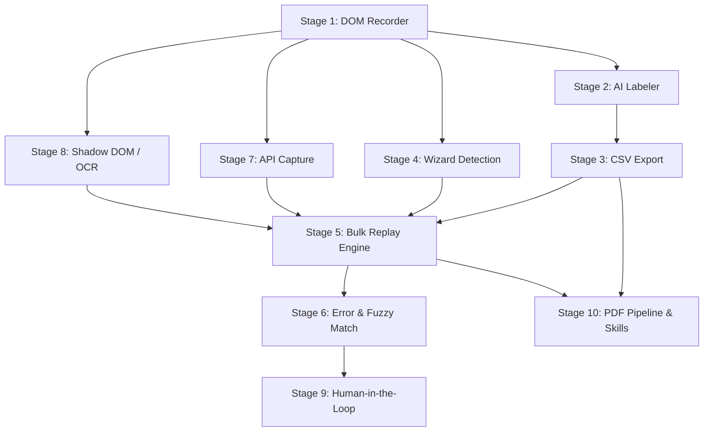

# Form Automation Engine — 10-Stage Implementation Plan

This plan integrates a full **Intelligent Form Recording, CSV Mapping, and Bulk Replay** system into the existing Rover Preview Helper + MultiRecorder app. It builds on the current architecture:

- **Chrome Extension** (`src/`): MV3 service worker, popup UI, content scripts
- **Electron Shell** (`main.cjs`, `index.html`, `renderer.js`): Desktop launcher with Playwright tracing
- **Existing Modes**: Playwright Trace, Rover Preview, BugBug, SeleniumBase

The new feature adds a 5th mode: **Form Recorder**.

---

## Stage 1: Form Recorder Content Script — DOM Interaction Capture

> **Goal**: Build the foundational content script that watches user interactions with form elements and records them into a structured field map.

### What changes

#### [NEW] `src/form-recorder/recorder.js`
A content script injected into the `ISOLATED` world. When activated:
- Attaches delegated event listeners for `focus`, `input`, `change`, `click` on the page
- Detects the **field type**: `text`, `email`, `number`, `select`, `checkbox`, `radio`, `date`, `file`, `textarea`
- For each interacted field, captures:
  - **Primary CSS selector** (stable: `id > name > aria-label > nth-child path`)
  - **Fallback XPath** (for shadow DOM / obfuscated frameworks)
  - **Semantic label** (from `<label>`, `aria-label`, `placeholder`, or nearest visible text node)
  - **Field type** and constraints (`required`, `pattern`, `min/max`, dropdown option list)
  - **The value the user entered** (becomes the first CSV row — the "example row")
- Detects **page transitions** (click on "Next"/"Continue"/"Submit" buttons) and records them as `__NAV__` entries in the field sequence, including the button selector
- Stores the complete field map in `chrome.storage.session` under `rover-form-recorder:fields`

#### [NEW] `src/form-recorder/selector-engine.js`
Utility module that generates resilient, ranked selectors:
1. `#id` (if unique and stable-looking, not random hashes)
2. `[name="field_name"]`
3. `[aria-label="..."]`
4. CSS path with `:nth-of-type` fallback
5. Full XPath as last resort

Each field gets a `selectorChain: string[]` — an ordered list of selectors to try, enabling auto-healing.

#### [MODIFY] `manifest.json`
- Add `"debugger"` permission (required for Stage 7's network monitoring via CDP)
- No new host permissions needed (`<all_urls>` already granted)

### Verification
- Unit tests for `selector-engine.js` covering ID, name, aria, nth-child, and XPath generation
- Manual test: activate recorder on a sample form, verify `chrome.storage.session` contains the correct field map

---

## Stage 2: Semantic Field Labeling via Rover AI

> **Goal**: Transform raw DOM selectors into human-readable column names using Rover's LLM intelligence.

### What changes

#### [NEW] `src/form-recorder/labeler.js`
After the user finishes recording a form:
1. Collects the raw field map from `chrome.storage.session`
2. Builds a prompt containing the field's: label text, placeholder, `name` attribute, surrounding DOM context (parent `<fieldset>`, sibling labels)
3. Sends the prompt to Rover via the existing MAIN-world bridge (`window.rover.send(...)`)
4. Parses Rover's structured JSON response, which maps each selector to a clean column name like `First Name`, `Invoice Total`, `Country`
5. Falls back to heuristic labeling (camelCase-to-words on `name` attr) if Rover is unavailable

The prompt is carefully structured:
```
Given these form fields, return a JSON array mapping each to a human-readable CSV column name:
[
  { "selector": "#fname", "label": "First name", "name": "fname", "type": "text" },
  { "selector": "select[name='country']", "label": "", "name": "country", "type": "select", "options": ["US","UK","AU"] }
]
Return: [{ "selector": "...", "columnName": "..." }, ...]
```

#### [MODIFY] `src/form-recorder/recorder.js`
- After recording completes, calls `labeler.js` to enrich each field with a `columnName`
- Updates the stored field map with the AI-generated labels

### Verification
- Unit tests for the heuristic fallback labeler
- Integration test: record a form, verify AI-generated column names are sensible

---

## Stage 3: CSV Schema Export & Template Generation

> **Goal**: Export the recorded field map as a downloadable CSV template with the example row pre-filled.

### What changes

#### [NEW] `src/form-recorder/csv-engine.js`
Core CSV serialization/deserialization engine:
- `generateTemplate(fieldMap)`: Creates a CSV where:
  - **Row 1 (Header)**: Human-readable column names from Stage 2 (`First Name`, `Country`, etc.)
  - **Row 2 (Metadata, hidden)**: A comment row (`# selector:...`) encoding the DOM selector chain for each column — this is what the playback engine reads
  - **Row 3 (Example)**: The values the user entered during recording
  - Navigation columns (`__NAV_1__`, `__NAV_2__`) are auto-inserted between page groups
- `parseCSV(csvText)`: Reads a user-filled CSV back into `{ columns, selectorMap, rows }`
- Handles proper escaping (RFC 4180): quoted fields, embedded commas, newlines

#### [MODIFY] Extension popup (`src/popup.html`, `src/popup.js`)
- When the Form Recorder mode is active, show a **"Download CSV Template"** button
- Triggers `csv-engine.js` to generate the file and uses `chrome.downloads.download()` to save it
- Also show a **"Upload Filled CSV"** button (file input) for the bulk replay flow (Stage 5)

#### [MODIFY] Electron dashboard (`index.html`, `renderer.js`)
- Add a new mode option: `Form Recorder` in the mode selector dropdown
- Show a panel listing saved form mappings (stored as JSON in `Desktop/MyRecords/form-maps/`)
- Allow CSV download/upload from the Electron UI as well

### Verification
- Unit tests for CSV generation and parsing (round-trip correctness, edge cases with commas/quotes/newlines)
- E2E test: record → export → re-import → verify field map integrity

---

## Stage 4: Conditional Logic & Multi-Page Wizard Detection

> **Goal**: Handle forms that span multiple pages and fields that appear/disappear based on other selections.

### What changes

#### [MODIFY] `src/form-recorder/recorder.js`
Enhanced recording logic:
- **Wizard detection**: When the user clicks a "Next"/"Continue"/"Submit" button that triggers a navigation or DOM mutation (but not a full page unload), the recorder:
  1. Snapshots the current field set as `Page N`
  2. Records the navigation action (button selector + click)
  3. Waits for the new page's fields to stabilize (using `MutationObserver` with a 2-second debounce)
  4. Begins recording `Page N+1` fields
- **Conditional field tracking**: Uses `MutationObserver` to detect when selecting a value (e.g., `Country = US`) causes new fields to appear. Records the dependency:
  ```json
  { "field": "State", "appearsWhen": { "field": "Country", "operator": "equals", "value": "US" } }
  ```
- The CSV metadata row encodes these dependencies so the playback engine can handle them

#### [NEW] `src/form-recorder/wizard-state.js`
State machine that tracks:
- Current page index in the wizard
- The navigation action to advance to the next page
- Fields per page
- DOM stability detection (waits for mutations to settle before recording new fields)

### Verification
- Integration test with a mock multi-page form (3 pages with "Next" buttons)
- Test conditional field: selecting a dropdown value triggers a new field to appear; verify it's captured in the dependency map

---

## Stage 5: Bulk Replay Engine — The Core Form Filler

> **Goal**: Given a filled CSV and a recorded field map, automatically fill the form for every row.

### What changes

#### [NEW] `src/form-recorder/replay-engine.js`
The heart of the system. For each CSV row:
1. **Navigate** to the form's starting URL (stored in the field map)
2. **Wait** for DOM stability (same `MutationObserver` approach as recording)
3. **For each field in the row**:
   a. Try selectors from the `selectorChain` in order until one matches
   b. Based on field type:
      - `text`/`email`/`number`/`textarea`: Clear the field, type the value with realistic keystroke delays (50–150ms randomized)
      - `select`: Find the matching `<option>` by text or value; if fuzzy match needed, flag for Stage 6
      - `checkbox`/`radio`: Click to set the correct state
      - `date`: Use the native date picker protocol or direct value injection
   c. After setting each field, dispatch `input`, `change`, and `blur` events to trigger framework reactivity (React, Vue, Angular)
   d. If the field has a conditional dependency, wait for the dependent field to appear before proceeding
4. **Handle wizard navigation**: Click the "Next" button, wait for page transition, continue filling
5. **Submit**: Click the final submit button
6. **Validate**: Check the page for success/error indicators (Stage 5b below)
7. **Log result**: Append `Status` and `Error_Reason` columns to an output CSV
8. **Loop**: Navigate back to the form start URL, begin next row

#### [NEW] `src/form-recorder/replay-worker.js`
Orchestrator that runs in the background service worker:
- Manages the row queue
- Tracks progress (`row 15/500`)
- Sends progress updates to the popup via `chrome.runtime.sendMessage`
- Supports pause/resume/cancel

#### [MODIFY] Extension popup (`src/popup.html`, `src/popup.js`)
- When a CSV is uploaded, show:
  - Row count and column preview
  - **"Start Bulk Fill"** button
  - Progress bar with `X/Y rows completed`
  - **Pause / Resume / Cancel** controls
  - Live error log

### Verification
- Integration test: create a 5-row CSV for a test form, run bulk replay, verify all 5 rows submitted correctly
- Test pause/resume mid-run
- Test that output CSV contains correct `Status` column

---

## Stage 6: Form Validation, Error Extraction & Fuzzy Matching

> **Goal**: Handle real-world form failures gracefully — read error messages, resolve data mismatches, and keep going.

### What changes

#### [NEW] `src/form-recorder/error-detector.js`
After each form submission attempt:
1. Scans the DOM for common error patterns:
   - Elements with `role="alert"`, `.error`, `.invalid`, `.field-error`, `aria-invalid="true"`
   - Red-bordered inputs (computed `border-color` in the red spectrum)
   - Text content matching patterns like "required", "invalid", "please enter"
2. Associates each error with the nearest form field
3. Returns a structured error report: `{ field: "Zip Code", message: "Please enter a valid zip code" }`

#### [NEW] `src/form-recorder/fuzzy-matcher.js`
When a `<select>` dropdown doesn't have an exact match for the CSV value:
1. Computes Levenshtein distance between the CSV value and all `<option>` texts
2. If the best match has a distance ≤ 3 (or similarity ≥ 80%), auto-selects it
3. If confidence is below threshold, flags for human review (Stage 9)
4. Handles common cases: `"USA"` → `"United States"`, `"NSW"` → `"New South Wales"`

#### [MODIFY] `src/form-recorder/replay-engine.js`
- After submit, call `error-detector.js`
- If errors found: log them to the output CSV's `Error_Reason` column, skip to next row
- Before filling selects, call `fuzzy-matcher.js` to resolve mismatches

### Verification
- Unit tests for `fuzzy-matcher.js` with common abbreviation → full name mappings
- Unit tests for `error-detector.js` with mock DOM fragments containing various error UI patterns
- Integration test: submit a row with an intentionally bad zip code, verify the error is captured in the output CSV

---

## Stage 7: Network Interception & API Reverse Engineering

> **Goal**: While the user records a form, silently capture the underlying API calls to enable a "direct API" fast path for bulk operations.

### What changes

#### [NEW] `src/form-recorder/network-capture.js`
Uses the Chrome DevTools Protocol (`chrome.debugger` API) to:
1. Attach to the active tab when form recording starts
2. Enable `Network.enable` and `Network.setRequestInterception`
3. Capture all `XHR`/`Fetch` requests triggered during form interactions
4. For each request, record:
   - Method, URL, headers, request body (form data or JSON)
   - Response status and body
5. When form submission is detected, identify the final POST/PUT request
6. Correlate request body fields with the recorded DOM fields (e.g., the form field `#fname` maps to JSON body key `firstName`)

#### [NEW] `src/form-recorder/api-spec-generator.js`
Generates an OpenAPI 3.0 spec from captured network data:
- Endpoint URL, method, content type
- Request schema (inferred from the captured body)
- Response schema
- Authentication headers (redacted values, preserved key names)
- Exportable as `form-api-spec.yaml`

#### [MODIFY] `src/form-recorder/replay-engine.js`
- When an API spec exists for a form, offer a **"Fast Mode"** toggle
- Fast Mode bypasses DOM interaction entirely and fires direct `fetch()` requests from the background worker
- Falls back to DOM mode if the API returns non-2xx

### Verification
- Integration test: record a form submission, verify the captured API spec matches the actual request
- Test Fast Mode with a mock API endpoint

---

## Stage 8: Shadow DOM / Canvas / Visual Fallback (OCR Bridge)

> **Goal**: Handle forms rendered inside Shadow DOM, iframes, Canvas, or other impenetrable containers.

### What changes

#### [MODIFY] `src/form-recorder/selector-engine.js`
Enhanced to pierce Shadow DOM:
- When a standard selector fails, walk the DOM tree looking for `shadowRoot` hosts
- Generate a "shadow path": `host-element >> shadow >> inner-selector`
- The replay engine uses this path to `querySelector` through shadow boundaries

#### [NEW] `src/form-recorder/visual-fallback.js`
For Canvas-based or fully obfuscated UIs:
1. Uses `chrome.tabs.captureVisibleTab()` to screenshot the form area
2. Sends the screenshot to Rover with a prompt: *"Identify all form fields, their labels, bounding boxes, and types"*
3. Rover returns structured coordinates: `{ label: "First Name", bbox: { x: 120, y: 340, w: 200, h: 30 }, type: "text" }`
4. The replay engine uses `chrome.debugger` + `Input.dispatchMouseEvent` / `Input.dispatchKeyEvent` to click at coordinates and type values

#### [MODIFY] `src/form-recorder/recorder.js`
- During recording, if no standard DOM form fields are detected within 5 seconds of page load, automatically trigger the visual fallback path
- Store visual field maps alongside DOM field maps

### Verification
- Test with a Salesforce Lightning component (Shadow DOM)
- Test with a simple Canvas-rendered form mock
- Verify that visual bounding box coordinates correctly target the fields

---

## Stage 9: Human-in-the-Loop & Confidence System

> **Goal**: When the automation is uncertain, pause and ask the human rather than silently doing the wrong thing.

### What changes

#### [NEW] `src/form-recorder/confidence.js`
Confidence scoring engine:
- **High (auto-proceed)**: Exact selector match, exact dropdown match, successful submit
- **Medium (proceed with warning)**: Fuzzy dropdown match ≥ 80%, selector fell back to XPath
- **Low (pause and ask)**: Fuzzy match < 80%, CAPTCHA detected, unexpected page state, no selector matched

#### [MODIFY] `src/form-recorder/replay-engine.js`
When confidence is **Low**:
1. Pause the bulk run
2. Bring the tab to the foreground via `chrome.tabs.update(tabId, { active: true })`
3. Inject a visual overlay highlighting the problematic field with a pulsing border
4. Show a popup notification: *"Row 47: Cannot match 'NSW' to any State option. Please select manually and click Resume."*
5. Wait for the user to interact, then capture the user's choice, update the fuzzy matcher's dictionary, and resume

#### CAPTCHA detection
- Check for common CAPTCHA indicators: `iframe[src*="recaptcha"]`, `iframe[src*="hcaptcha"]`, `#captcha`, `.g-recaptcha`
- If detected, pause and bring tab to foreground for human solve

### Verification
- Test: upload a CSV with intentionally ambiguous values, verify the system pauses at the right row
- Test CAPTCHA detection with a mock reCAPTCHA iframe

---

## Stage 10: PDF-to-CSV Pipeline & Macro-to-Skill Converter

> **Goal**: Enable zero-manual-entry workflows by extracting data directly from documents, and convert recorded macros into reusable AI Skills.

### What changes

#### [NEW] `src/form-recorder/pdf-pipeline.js`
Document-to-CSV pipeline using your LlamaParse API key:
1. User uploads PDF(s) via the popup or Electron UI
2. Extension sends each PDF to the LlamaParse API (`llx-RO1gFTPH...`)
3. Parses the returned markdown/structured data
4. Maps extracted fields to the CSV schema using Rover AI:
   - Prompt: *"Given this invoice markdown and this CSV schema [First Name, Amount, Due Date], extract matching values"*
5. Generates a filled CSV automatically
6. Pipelines directly into the bulk replay engine

#### [NEW] `src/form-recorder/skill-converter.js`
Converts a recorded form macro into a reusable Rover "Skill":
1. Takes the field map + navigation sequence from a recording
2. Generates a natural language description: *"Fill out the vendor registration form on acme.com with the provided data, navigating through 3 pages"*
3. Saves as a `.skill.json` file containing:
   - The semantic description (for Rover to understand intent)
   - The field map (for deterministic replay)
   - The API spec (for fast mode, if captured)
4. When the user invokes the skill on a **different but similar** form, Rover reads the skill description and adapts the field mapping to the new DOM

#### [MODIFY] Electron dashboard (`index.html`, `renderer.js`)
- Add a **Skills Library** panel in the sidebar
- List saved `.skill.json` files with name, target domain, field count
- Allow drag-and-drop PDF upload for the pipeline

#### [MODIFY] `manifest.json`
- Add `"downloads"` permission for CSV/spec file export

### Verification
- Integration test: upload a sample PDF invoice, verify extracted CSV matches expected schema
- Test skill converter: record a form, export as skill, verify the `.skill.json` contains correct semantic description
- Full pipeline test: PDF → CSV → Bulk Fill → Output CSV with success/error status

---

## New File Summary

| Stage | New Files | Purpose |
|-------|-----------|---------|
| 1 | `src/form-recorder/recorder.js`, `selector-engine.js` | DOM interaction capture & selector generation |
| 2 | `src/form-recorder/labeler.js` | AI-powered semantic field naming |
| 3 | `src/form-recorder/csv-engine.js` | CSV template generation & parsing |
| 4 | `src/form-recorder/wizard-state.js` | Multi-page form state machine |
| 5 | `src/form-recorder/replay-engine.js`, `replay-worker.js` | Bulk form filling engine |
| 6 | `src/form-recorder/error-detector.js`, `fuzzy-matcher.js` | Error extraction & data resolution |
| 7 | `src/form-recorder/network-capture.js`, `api-spec-generator.js` | API reverse engineering |
| 8 | `src/form-recorder/visual-fallback.js` | OCR/Canvas fallback |
| 9 | `src/form-recorder/confidence.js` | Human-in-the-loop system |
| 10 | `src/form-recorder/pdf-pipeline.js`, `skill-converter.js` | Document pipeline & skill export |

## Modified Files

| File | Changes |
|------|---------|
| [manifest.json](file:///c:/Users/home/Downloads/rover-preview-helper-main/rover-preview-helper-main/manifest.json) | Add `debugger`, `downloads` permissions |
| [popup.html](file:///c:/Users/home/Downloads/rover-preview-helper-main/rover-preview-helper-main/src/popup.html) | Form recorder UI panel (record/download/upload/progress) |
| [popup.js](file:///c:/Users/home/Downloads/rover-preview-helper-main/rover-preview-helper-main/src/popup.js) | Form recorder mode logic, CSV handling, progress display |
| [popup.css](file:///c:/Users/home/Downloads/rover-preview-helper-main/rover-preview-helper-main/src/popup.css) | Styles for recorder panel, progress bar, confidence overlays |
| [background.js](file:///c:/Users/home/Downloads/rover-preview-helper-main/rover-preview-helper-main/src/background.js) | Message handlers for recorder, replay orchestration |
| [main.cjs](file:///c:/Users/home/Downloads/rover-preview-helper-main/rover-preview-helper-main/main.cjs) | New `form-recorder` Electron mode |
| [index.html](file:///c:/Users/home/Downloads/rover-preview-helper-main/rover-preview-helper-main/index.html) | Form Recorder mode in dropdown, Skills Library panel |
| [renderer.js](file:///c:/Users/home/Downloads/rover-preview-helper-main/rover-preview-helper-main/renderer.js) | Skills panel rendering, PDF upload handler |
| [package.json](file:///c:/Users/home/Downloads/rover-preview-helper-main/rover-preview-helper-main/package.json) | Add `csv-parse`, `@llamaindex/llama-cloud` dependencies |

## Dependency Order



## Verification Plan

### Automated Tests
```bash
# Unit tests (Stages 1-10 modules)
pnpm test

# E2E integration (full record → CSV → replay pipeline)
pnpm test:integration
```

### Manual Verification
- Record a real multi-page form (e.g., a government registration form)
- Export CSV, fill 10 rows, run bulk replay
- Verify error handling with intentionally bad data
- Test PDF pipeline with a sample invoice
- Test skill export/import cycle

> [!IMPORTANT]
> This plan adds ~14 new source files in `src/form-recorder/` and modifies 9 existing files. The implementation should proceed stage-by-stage, with each stage independently testable. Stages 1–5 form the critical path; Stages 6–10 are progressive enhancements.
